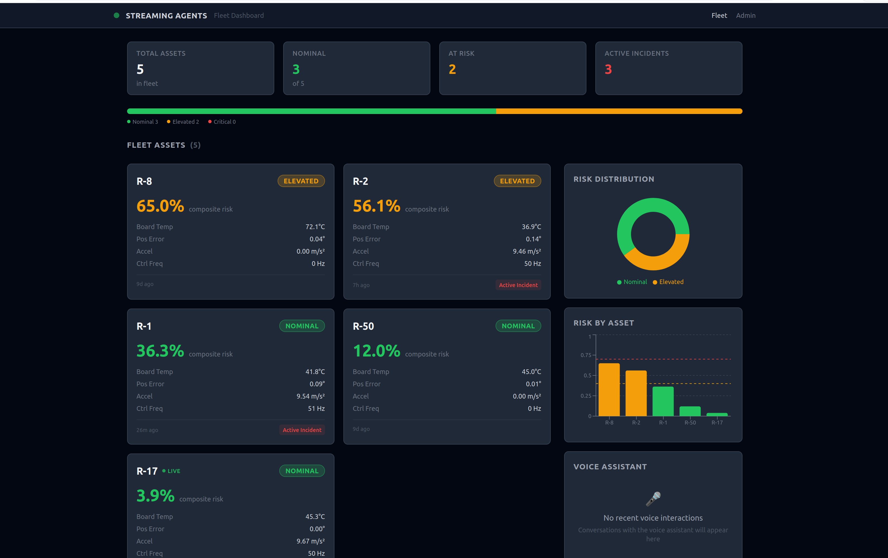
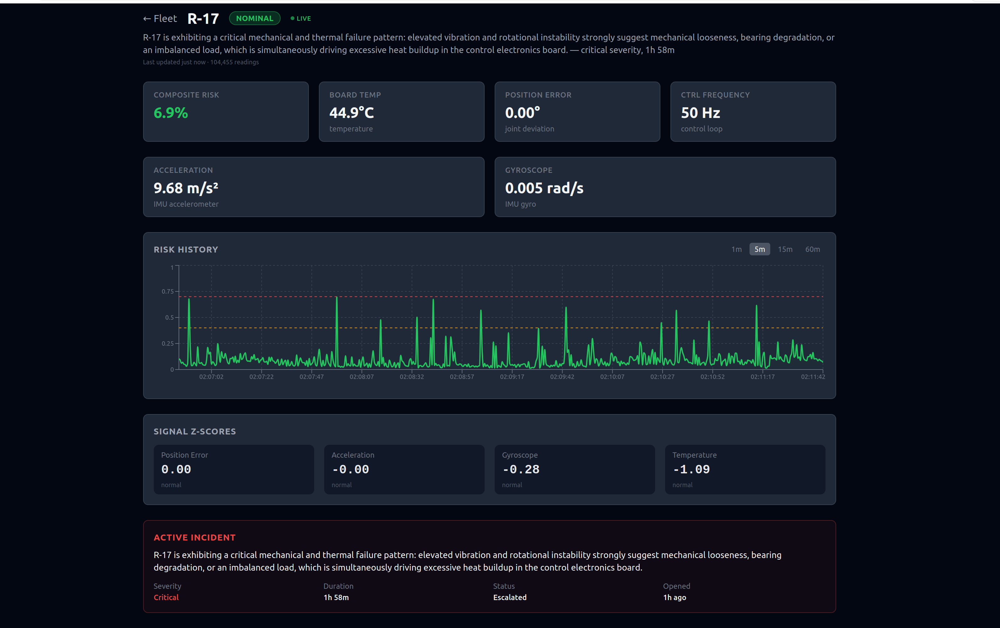
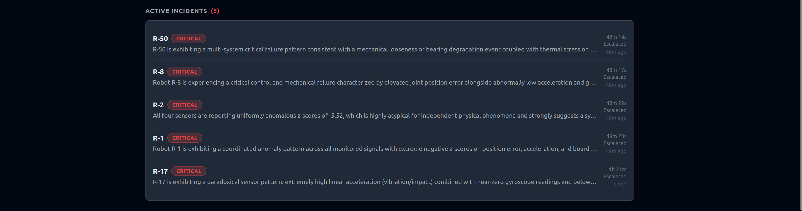
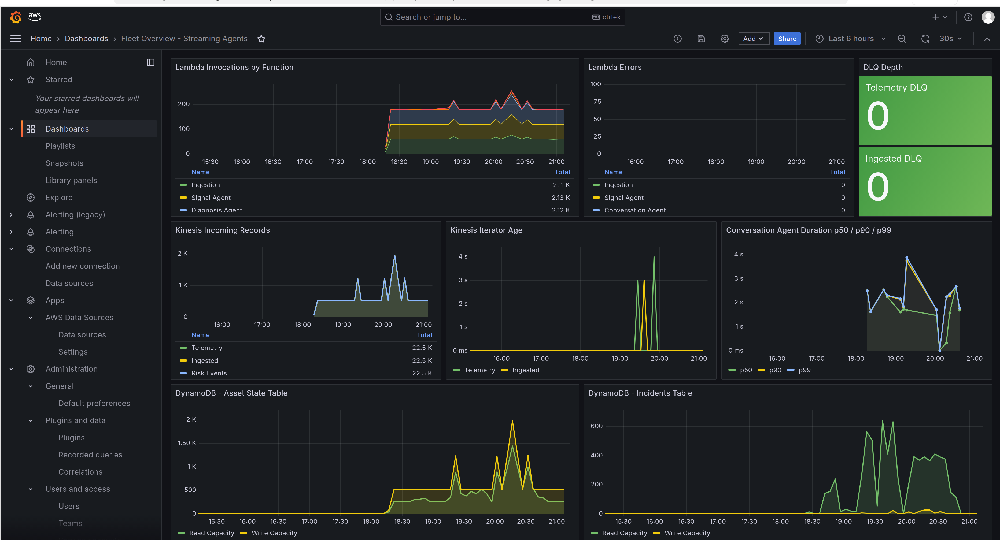
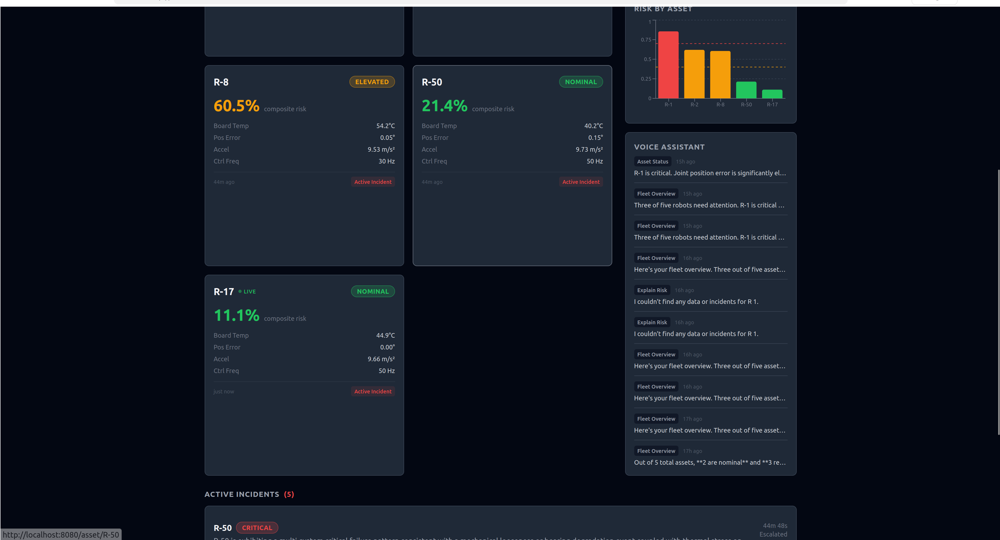

# AIdeas: Streaming Agents — A Voice-Driven AI Copilot for Robotic Fleet Maintenance

<!--
BUILDER CENTER METADATA
========================
Tags: #aideas-2025  #workplace-efficiency  #NAMER
Cover image: img/hero.png
Alt text: R-17 on my desk with the Streaming Agents fleet dashboard monitoring live robotic telemetry
-->

---

## App Category

**Workplace Efficiency**

---

## My Vision

There's a robot on my desk. Its name is R-17.

Right now, it's running fine — head tracking smoothly, board temperature stable, control loops humming at 50 Hz. But in about eight minutes, that's going to change. Joint 3 will start drifting. Temperature will creep up. The position error between where the servo *wants* to be and where it *actually is* will slowly grow. And if nobody catches it, R-17 will fault out.

Now imagine R-17 isn't alone. Imagine 200 of these robots on a warehouse floor — picking, sorting, moving — 24 hours a day. One of them is about to fail. Which one? When? Why? And what should you do about it?

That's what **Streaming Agents** answers.

I built a real-time predictive maintenance copilot that continuously monitors live telemetry from robotic systems, detects early warning signs of failure *before* they happen, and explains the risk in plain English — through the robot's own speaker. Instead of staring at dashboards and parsing logs, a floor supervisor can simply ask:

> *"Hey, how's the fleet doing?"*

And hear R-17 respond:

> *"Two of six robots need attention. R-17 is showing progressive joint position drift on actuator 3 — I'd recommend scheduling an inspection within the next shift. R-8 has elevated board temperature but it's stable for now."*

No data science degree required. No dashboard fatigue. Just clear answers and actionable recommendations — spoken by the robot itself.

---

## Why This Matters

Unplanned downtime is the silent killer of operational efficiency.

In warehouse robotics alone, a single robot going down unexpectedly can cascade into missed picks, delayed shipments, and manual workarounds that cost thousands per hour. Across manufacturing, logistics, and facility operations, unplanned equipment failures account for an estimated **$50 billion annually** in lost productivity.

The traditional approach — wait for something to break, then scramble to fix it — is reactive, expensive, and entirely avoidable.

Predictive maintenance promises to fix this, but most solutions require dedicated data science teams, months of model training, and expensive sensor infrastructure. Small and mid-size operations teams get left behind.

**Streaming Agents changes that equation.** It brings enterprise-grade predictive maintenance to teams that lack dedicated reliability engineering resources. The system watches the telemetry so humans don't have to, speaks up when something is wrong, and explains *why* in language anyone can understand.

This matters because:

- **Maintenance engineers** get early warnings instead of emergency calls
- **Floor supervisors** can ask natural language questions instead of interpreting dashboards
- **Facility managers** see fewer surprise outages and lower maintenance costs
- **Operations teams** move from reactive firefighting to proactive planning

And because we built it on real hardware with real sensors, this isn't a theoretical exercise — it's a working system monitoring a real robot, right now, on my desk.

---

## How I Built This

### The Architecture: Four Specialized Agents

Streaming Agents isn't a monolith — it's a pipeline of four specialized agents, each with a distinct responsibility, connected by Amazon Kinesis streams. The first four stages form the event-driven telemetry pipeline; the Conversation Agent is query-driven and reads the resulting state, incidents, and diagnoses from DynamoDB on demand.

```
Edge Exporter (RPi)
      │
      ▼
┌─ Kinesis: r17-telemetry ─┐
│                           │
│   Ingestion Service       │
│   (validate + enrich)     │
│                           │
├─ Kinesis: r17-ingested ──┤
│                           │
│   Signal Agent            │──────┐
│   (baselines + risk)      │      │
│                           │      ▼
├─ Kinesis: r17-risk-events┤   DynamoDB
│                           │   (asset state
│   Diagnosis Agent         │    + incidents)
│   (Bedrock explains why)  │      ▲
│                           │      │
├─ Kinesis: r17-diagnosis ─┤      │
│                           │      │
│   Actions Agent           │──────┘
│   (incidents + response)  │
│                           │
└─ Kinesis: r17-actions ───┘

    Conversation Agent ◄──── queries DynamoDB on demand
    (Lex + Polly + Speaker)    (not pipeline-driven)
```


*Fleet Overview: six robotic assets monitored in real time, with live risk states and active incidents surfaced in one operator view.*

**1. Signal Agent** — The Watcher

The Signal Agent consumes live telemetry from the robot's edge exporter via Amazon Kinesis. For every data point, it maintains rolling baselines using exponential moving averages, computes z-scores for anomaly detection, and calculates a **composite risk score** using a deterministic, weighted formula:

```
Composite Risk =
    0.35 × abs(position_error_z)
  + 0.25 × abs(accel_z)
  + 0.15 × abs(gyro_z)
  + 0.15 × abs(temperature_z)
  + 0.10 × threshold_breach
```

Risk states: nominal (< 0.50), elevated (0.50–0.75), critical (≥ 0.75). This isn't a black box — every weight is explainable, every score is reproducible. The LLM never touches this math.


*R-17 asset detail: deterministic risk scoring over time, with telemetry trends, thresholds, and signal-level degradation visible at a glance.*

**2. Diagnosis Agent** — The Detective

When risk crosses the elevated threshold, the Diagnosis Agent activates. It loads the asset's state from DynamoDB, examines which signals are contributing most to the score, and calls Amazon Bedrock (Claude Sonnet) with a structured prompt containing the risk context. Bedrock returns a structured diagnosis:

```json
{
  "root_cause": "Joint actuator 3 showing progressive position drift consistent with mechanical wear",
  "evidence": [
    { "signal": "joint_position_error_deg", "observation": "Position error exceeding baseline by 3.2 standard deviations", "z_score": 3.2 },
    { "signal": "board_temperature_c", "observation": "Temperature trending upward, 2.1σ above baseline", "z_score": 2.1 }
  ],
  "confidence": "high",
  "recommended_actions": ["Schedule actuator inspection", "Reduce operational load"],
  "severity": "warning"
}
```

The critical design decision: Bedrock explains the risk scores computed by the Signal Agent. It does not compute them. The reasoning is deterministic. The LLM narrates it clearly — it doesn't invent it.

A 30-second debounce per asset prevents runaway Bedrock costs. When risk drops back to nominal, the Diagnosis Agent emits a lightweight "info" event (no Bedrock call) so the pipeline knows to resolve the incident.

**3. Actions Agent** — The Operator

The Actions Agent applies deterministic rules — no LLM — to decide what to do with each diagnosis. It manages an incident lifecycle in DynamoDB: incidents are *opened* on first warning, *escalated* if risk persists beyond 60 seconds or goes critical, and *resolved* when the Signal Agent reports nominal again. Duplicate suppression ensures one incident per asset at a time. Every action is logged with full traceability.


*Diagnosis and incident view: contributing signals, structured explanation, incident lifecycle, and deterministic scoring all surfaced in one operational view.*

**4. Conversation Agent** — The Voice

This is where it gets real. The Conversation Agent is an Amazon Lex V2 bot with five custom intents: fleet overview, asset status, explain risk, recommend action, and acknowledge incident. When an operator speaks, Lex resolves the intent, triggers a Lambda fulfillment function that queries DynamoDB for the current fleet state and active incidents, builds a context-aware prompt for Bedrock, and returns a natural language response. Amazon Polly synthesizes the speech, and on our Reachy Mini, it plays directly through the robot's speaker.

The voice terminal runs as a native Reachy daemon app on the Raspberry Pi, using the robot's 4-microphone array for input and its built-in speaker for output. Energy-based voice activity detection (tuned to filter the robot's own motor noise) triggers capture, and the full audio round-trip — speech to Lex to Lambda to Bedrock to Polly and back — completes in 2-3 seconds.

### The Edge: Real Hardware, Real Telemetry

Here's where this project diverges from most demos: **the telemetry is real.**

R-17 is a Reachy Mini — a wireless, Raspberry Pi 5-powered desktop robot with a 6-degree-of-freedom Stewart platform head, 7 head actuators, a 4-microphone array, a speaker, and an onboard IMU. It runs a FastAPI daemon that exposes joint positions, motor states, and system health metrics via REST API.

I built an edge exporter that runs directly on the robot's Raspberry Pi as a systemd service. Every 500 milliseconds, it reads real control and joint telemetry — actuator positions from all 7 head joints, motor control state, control loop frequency, and error codes — computes derived signals like position error, validates each event against the telemetry v2 schema, and publishes to Amazon Kinesis. IMU-derived signals (acceleration, gyroscope, board temperature) are defined in the telemetry model and validated in the schema, with live exporter integration in progress. A fleet simulator running on EventBridge generates synthetic telemetry for the rest of the fleet using deterministic degradation scenarios (including all signal types), so the system always has realistic multi-robot data flowing through the full pipeline.

The telemetry model supports the following operational signals:

| Signal | Source | Status | What It Tells Us |
|--------|--------|--------|-----------------|
| Joint Position Error (°) | Commanded vs. actual position | Live | Servo degradation — struggling to reach targets |
| Control Loop Frequency (Hz) | Daemon statistics | Live | System health — computational stress |
| Control Loop Error Count | Daemon statistics | Live | Cumulative hardware fault accumulation |
| Board Temperature (°C) | IMU / system sensor | Schema supported; exporter integration in progress | Thermal state |
| Acceleration Magnitude (m/s²) | IMU accelerometer | Schema supported; exporter integration in progress | Vibration signature — mechanical looseness |
| Gyroscope Magnitude (rad/s) | IMU gyroscope | Schema supported; exporter integration in progress | Rotational instability |

This is exactly how industrial predictive maintenance works — vibration analysis, thermal monitoring, and position accuracy tracking — just on a desktop robot instead of a 2-ton CNC machine.

### The AWS Stack

| Service | Role |
|---------|------|
| **Amazon Kinesis Data Streams** | 5 streams forming the real-time telemetry pipeline backbone |
| **AWS Lambda** | 7 functions: simulator (controller + worker), ingestion, signal/diagnosis/actions/conversation agents |
| **Amazon DynamoDB** | Asset state with rolling baselines, incident tracking with GSI for active lookups |
| **Amazon Bedrock (Claude Sonnet)** | Powers diagnosis explanations and conversational responses |
| **Amazon Lex V2** | Voice input — natural language understanding with 5 custom intents |
| **Amazon Polly** | Neural voice output — R-17 speaks its own health status |
| **Amazon EventBridge** | Cron scheduling for fleet simulation |
| **Amazon Managed Grafana** | Fleet overview dashboard with real-time CloudWatch metrics |
| **Amazon CloudWatch** | Metrics, logs, and observability for pipeline health |
| **Amazon SQS** | Dead-letter queues for pipeline reliability (4 DLQs) |
| **Amazon S3** | Lambda artifact storage for CI/CD pipeline |

The entire infrastructure is defined in Terraform (with separate LocalStack and AWS sandbox workspaces), deployed via GitHub Actions with OIDC authentication — no stored credentials. The project runs in an isolated AWS sandbox account, with cost-saving schedulers that disable Kinesis streams outside working hours.


*Grafana fleet dashboard: real-time CloudWatch metrics across all pipeline stages.*

### Development with Kiro and Claude Code

I used a contracts-first development approach that made AI coding tools dramatically more effective. Before writing any code, I created detailed architecture documentation: service contracts for each Lambda (what it receives, what it does, what it emits, what it must NOT do), event schema contracts for every Kinesis payload, and Kiro agent definitions that act as code review stewards.

Kiro's agents enforce architectural boundaries during code review — the Schema Steward guards against breaking changes to locked schemas, the Kinesis Governance agent validates stream topology and DLQ rules, the Lambda Patterns agent ensures every handler follows the BaseLambdaHandler hexagonal architecture, and the Testing Steward catches coverage gaps. This meant Claude Code could generate implementation from the service contracts while Kiro reviewed for compliance, catching issues like a handler accidentally computing risk scores (that's the Signal Agent's job, not the Diagnosis Agent's).

The result: 105+ unit tests across 5 shared packages and 7 Lambda services, all passing, with clean separation of concerns enforced by the agent definitions rather than code review burden.

---

## Demo

<!-- [INSERT — Demo video embed, 30-60 seconds] -->

[](https://youtu.be/kykrO5kTq6Y?si=rVvAYyNnYfNbBHy2)

In the demo, R-17 sits on my desk running its normal movement patterns while the edge exporter streams real telemetry into the pipeline at 2 Hz. Meanwhile, the fleet simulator generates synthetic data for five additional robots — four healthy, one with a thermal degradation scenario. The Grafana dashboard shows all six robots with their real-time risk states.

Then I speak directly to R-17: *"Give me a fleet overview?"* The robot's microphone captures my voice, Lex resolves the intent, the fulfillment Lambda queries DynamoDB for the current fleet state and calls Bedrock for a conversational summary, and R-17 answers through its own speaker: *"Two of six robots need attention..."*


*Voice copilot in action: operator question, resolved intent, Bedrock-backed response, and spoken answer through R-17's speaker.*

I follow up with asset-specific questions and hear responses grounded in the robot's current telemetry, rolling baselines, and risk state. The full diagnosis-and-action voice flows are implemented in the platform and produce detailed explanations when the simulator populates the full incident pipeline. The entire voice interaction takes about 2-3 seconds per exchange.

---

## What I Learned

### Deterministic reasoning builds trust

Early in the project, I faced a critical design decision: should the LLM analyze the telemetry and determine what's failing? The answer was a firm no. In operational environments, people need to *trust* the system's reasoning. If an AI tells you to shut down a robot for maintenance, you need to understand *exactly* why — and the answer needs to be the same every time you ask.

By building the risk scoring and diagnosis logic as deterministic, explainable algorithms — and only using the LLM to narrate the results in natural language — we get the best of both worlds: rigorous, reproducible reasoning with a human-friendly interface.

### Real hardware changes everything

I could have simulated all the telemetry. It would have been faster and easier. But building the edge exporter to read real joint positions, control loop metrics, and motor states from an actual robot forced me to confront the messiness of real-world data — sensor noise, timing jitter, the difference between what documentation says a robot exposes and what it actually exposes.

That experience directly shaped the architecture. The rolling baseline approach with exponential moving averages, the z-score anomaly detection, the voice activity detection threshold tuned to filter the robot's own motor noise at 0.025 RMS — all of these emerged from working with real hardware, not from a whiteboard.

### Streaming changes how you think about AI

Most AI applications are request-response: you ask, it answers. Streaming Agents is fundamentally different. The system is *always watching*, always computing, always updating its risk model. The AI doesn't wait for you to ask — it proactively creates incidents when risk exceeds thresholds. The conversation interface is important, but it's the *last* step in a pipeline that's been running continuously.

This shift — from reactive AI to proactive, streaming AI — is where I believe the next wave of enterprise AI applications will emerge.

### The robot talks back

When I first built the cloud conversation stack, it worked fine as a text API. You could send `recognize-text` calls to Lex and get back JSON responses. But when I wired it all the way through to the robot — packaging the voice terminal as a native Reachy daemon app, capturing speech through the 4-microphone array, sending audio to Lex, running through the full Lambda → Bedrock pipeline, and playing the Polly response through the robot's own speaker — the experience transformed.

I could literally ask R-17 "What's wrong with you?" and hear it explain its own health status. It went from a monitoring tool to a *copilot*. That's a meaningful difference for a maintenance engineer who has their hands full and can't stare at a screen.

### Contracts before code

The most productive architectural decision was writing service contracts and Kiro agent definitions before any implementation. Each document defined exactly what a service receives, what it does, what it emits, and — critically — what it must NOT do. These contracts became the prompts for Claude Code: "Read this contract, build this service." And the Kiro agents became automated reviewers that caught violations of the architecture in code review.

This meant I could parallelize implementation across services with confidence that they'd integrate correctly. The ingestion service, signal agent, and diagnosis agent were all built against their contracts and wired together with zero integration bugs. The contracts were the integration tests.

---

<!--
POST-PUBLICATION CHECKLIST
===========================
Before publishing:
[x] Cover image: img/hero.png
[ ] Demo video recorded and embedded (replace "[Demo video to be inserted]")
[x] Fleet Overview screenshot inserted (after architecture diagram)
[x] Asset Detail screenshot inserted (after Signal Agent)
[x] Diagnosis/Incident screenshot inserted (after Actions Agent)
[x] Voice Interaction screenshot inserted (in Demo section)
[x] Grafana dashboard screenshot inserted (after AWS Stack table)
[ ] Tags applied: #aideas-2025 #workplace-efficiency #NAMER
[ ] Builder Center profile updated
[x] Proofread for technical accuracy
[x] No placeholder text remaining (except demo video)

After publishing:
[ ] Share on LinkedIn, Twitter/X, dev communities
[ ] Post in AIdeas Builder Space
[ ] Cross-promote in robotics / IoT communities
[ ] Engage with comments promptly
-->
